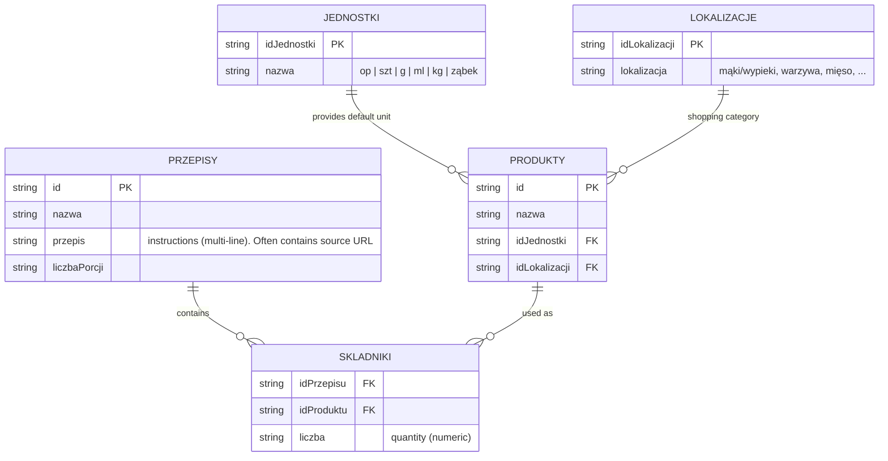
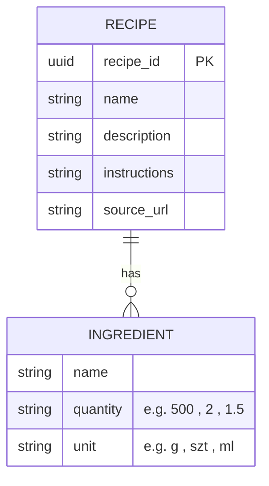

# Legacy Przepisy Data Schema (from CSV export)

This documents the relational structure found in `/mnt/f/usb/przepisy/` (exported from the original OpenOffice/LibreOffice Base `.odb`).

## Source Relational Schema (Legacy)



### Notes on Source Data
- `SKLADNIKI.liczba` is the quantity. The **unit** is looked up from the linked `PRODUKTY.idJednostki`.
- Many recipes have their original source URL stored *inside* the `przepis` text field (not a dedicated column).
- One entry (`cotygodniowe spożywcze`) appears to be a weekly shopping list rather than a cooking recipe (empty instructions).
- ~159 recipes, ~308 products, ~1640 ingredient links.

## Target Application Schema (meal_planner_app)

The app uses a denormalized in-memory model (no global product master list):



### Mapping During Migration (extract_from_csvs)

| Legacy (CSV)                  | App (Recipe / Ingredient)          | Logic |
|-------------------------------|------------------------------------|-------|
| przepisy.nazwa                | Recipe.name                        | direct |
| przepisy.przepis              | Recipe.instructions                | direct (or placeholder if it was only a URL) |
| extracted http(s)://... from przepis | Recipe.source_url            | first URL found |
| "Migrated ... (porcje: X)"    | Recipe.description                 | constructed |
| (via SKLADNIKI)               | Recipe.ingredients[]               | join |
| produkty.nazwa                | Ingredient.name                    | denormalized |
| skladniki.liczba              | Ingredient.quantity                | as string |
| produkty.idJednostki -> jednostki.nazwa | Ingredient.unit | resolved unit name |
| produkty.idLokalizacji        | Ingredient.location_id             | the location id |
| produkty -> lokalizacje       | Ingredient.location                | resolved name (for grouping) |

Both `location_id` and `location` (name) are now populated when importing from the relational CSVs. `LOKALIZACJE` names are resolved for easy grouping. `JEDNOSTKI` resolved for unit name.

## Quick Usage

When the legacy dir is mounted at `/app/legacy`:

```bash
# Inside container
python -m meal_planner_app.migrate_legacy
# or
python -m meal_planner_app.migrate_legacy /path/to/the/csv/dir
```

The loader will automatically prefer the relational set (`przepisy.csv` + `skladniki.csv` + `produkty.csv`).

## Sample Transformed Recipe

From real data:

```json
{
  "name": "kurczak z jarmużem i ryżem",
  "source_url": "",
  "description": "Migrated from legacy przepisy CSV export (porcje: 1)",
  "instructions": "1. drobno pokroić cebulę\n2. ...",
  "ingredients": [
    {"name": "filet z kurczaka", "quantity": "500", "unit": "g"},
    {"name": "cebula", "quantity": "2", "unit": "szt"},
    {"name": "jarmuż", "quantity": "1", "unit": "op"},
    ...
  ]
}
```

Another (with source):

```json
{
  "name": "kurczak słodko kwaśny",
  "source_url": "https://www.kwestiasmaku.com/przepis/kurczak-slodko-kwasny",
  "instructions": "See source_url for full original instructions. (auto-migrated from przepisy CSV)",
  ...
}
```

This gives clean, structured data without the previous binary-heuristic noise.
