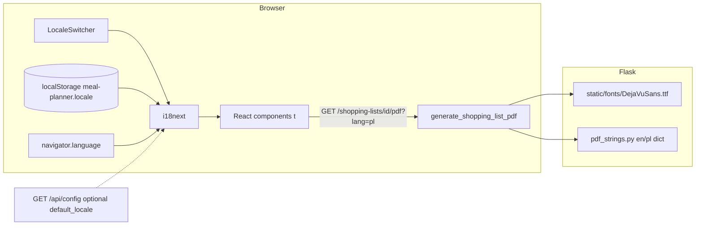
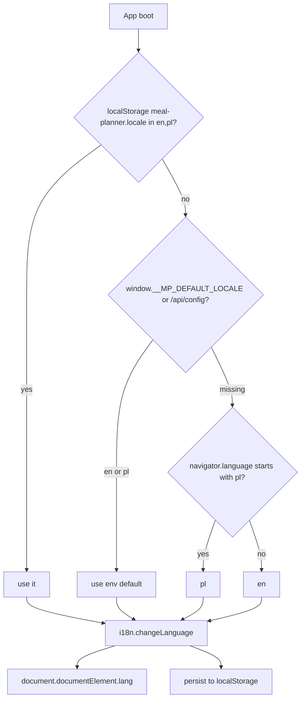

# Internationalization (i18n) of the Meal Planner App

**Author:** TBD  
**Date:** 2026-09-04  
**Status:** Draft  
**Branch:** `docs/i18n-design`  
**Code snapshot:** `origin/main` @ `30460250` (`fix: import empty-instruction recipes and add meal-plan back link (#41)`)

---

## Overview

The Meal Planner is a single-user Flask + React Docker app. Recipe **content** is largely Polish (legacy `przepisy.csv` / `.odb` import of ~159 recipes), while all React chrome, empty states, confirmations, and PDF labels are hardcoded English. PDF export (`generate_shopping_list_pdf` in `meal_planner_app/services.py`) can drop Polish diacritics: it uses system DejaVu if `/usr/share/fonts/truetype/dejavu/DejaVuSans.ttf` exists, otherwise NFKD + latin-1 sanitization. Even the DejaVu path still NFKD-decomposes text, which is the wrong Unicode form for PDF core/TTF rendering of precomposed Latin Extended-A glyphs (`ą ć ę ł ń ó ś ź ż`).

This design adds **en + pl UI chrome** via `i18next` / `react-i18next`, a client-side locale switcher persisted in `localStorage` (with `navigator.language` and optional `MEAL_PLANNER_DEFAULT_LOCALE` fallbacks), and **lossless Polish PDF** by bundling a Unicode TTF and emitting NFC text. Stored user content (recipe names, instructions, ingredient names, units, locations) is **not** auto-translated.

---

## Background & Motivation

### Current state (verified in tree)

| Layer | Finding |
|---|---|
| React SPA | `frontend/package.json` has `react`, `react-dom`, `react-router-dom`, `axios`, `prop-types`. **No** `i18next`, `react-i18next`, or similar. |
| Flask | `pyproject.toml` depends on `Flask` + `fpdf2`. **No** Flask-Babel / Babel / gettext. |
| HTML | `frontend/index.html` is `<html lang="en">`. Title `"Meal Planner"` is hardcoded. |
| Auth | None. All routes open. No user profile, no per-user locale column. |
| Locale | No `Accept-Language` handling, no cookie, no env locale. |
| PDF | Docker images **do** install `fonts-dejavu-core` (`Dockerfile` line 50, `.devcontainer/Dockerfile` line 17). Native CI pytest and host runs often do **not**. |
| Content | Legacy import is Polish (`docs/legacy_przepisy_schema.md`: `przepis`, `składniki`, `lokalizacje`, units like `ząbek`). Seed data (`seed_db.py`) is English (`Classic Pancakes`, `Simple Omelette`). Mixed-language catalogs are expected. |
| Docs | `.ai/progress.md` marks i18n **Partial**: “PDF: DejaVu if present, else NFKD/latin-1 sanitize”. `.ai/requirements.md` has NFR usability (2.2) but **no dedicated i18n FR**. Recommended next work item 8: “Proper i18n (stop relying on PDF sanitization).” |

### Pain points

1. **Chrome vs content mismatch.** A Polish speaker importing `przepisy.csv` sees “Recipes / Create New Recipe / Loading recipes…” around Polish dish names. The inverse is also true after seeding: English recipes behind a Polish OS with no way to pick a UI language.
2. **PDF character loss.** `sanitize_for_pdf` NFKD-decomposes then `encode("latin-1", errors="ignore")`. `ę` → `e` + combining ogonek → combining mark dropped → `e`. `ł` similarly becomes `l`. Native pytest (no DejaVu) silently produces wrong PDFs. Tests decode PDF as latin-1 (`test_shopping_list_api.py`) and never assert Polish glyphs.
3. **NFKD even with DejaVu.** `_pdf_text` still runs `unicodedata.normalize("NFKD", …)` when `has_unicode_font` is true. Combining marks often fail to render as a single glyph in fpdf2 TTF subsetting. Polish needs **NFC** (precomposed) code points that DejaVu actually contains.
4. **Hardcoded strings everywhere.** ~120–150 user-visible English literals across 11 JSX files, plus PDF chrome in `services.py`, plus default shopping-list name in `crud.py` (`f"Shopping List for {meal_plan.name}"`). Playwright E2E (`frontend/e2e/main.spec.js`) locates by those English roles (`"Recipes"`, `"Create New Recipe"`, `"Generate from Meal Plan"`, placeholders `'Ingredient name'` / `'Item name'`).
5. **No string workflow.** Adding a button means grepping JSX. There is no catalog, no plural rules, no `lang` update.

### Constraints that shape the design

- Single-user local Docker app. No multi-tenant i18n backend.
- React is the only HTML UI (`/ui/`; Jinja decommissioned).
- Docker-first: lockfile must be regenerated in `node:20-alpine`; fonts must work in `python:3.9-slim-bullseye` **and** in pytest without apt.
- E2E currently assumes English. Default locale must remain `en` so existing Playwright tests keep passing until locators are dual-keyed.

---

## Goals & Non-Goals

### Goals (v1)

1. Translate **all UI chrome** (nav, headings, buttons, labels, placeholders, empty states, confirms, alerts, loading/error copy) to **English and Polish**.
2. Provide an explicit locale switcher; persist choice in `localStorage`; detect browser language on first visit; allow an env default for Polish-first Docker deploys.
3. Make shopping-list PDF **lossless for Polish** (and other Latin Extended-A) regardless of whether system DejaVu is installed. Bundle a Unicode TTF. Stop NFKD + latin-1 stripping on the happy path.
4. Translate PDF **chrome** (title, column headers, empty message) to the active locale via a `?lang=` query param on the existing PDF routes.
5. Format counts with proper **plural rules** (English `1 recipe` / `N recipes`; Polish `one` / `few` / `many` / `other`).
6. Define a repeatable **string-addition workflow** (en source of truth, pl in the same PR, key-parity CI check).
7. Keep stored **user content** in the language the user (or importer) wrote it. Display as-is.
8. Land incrementally: each PR independently reviewable and mergeable; E2E stays green.

### Non-goals (v1)

- Machine-translating the ~159 imported recipes (names, instructions, ingredient names).
- RTL scripts, CJK, or a third locale.
- Flask-Babel / gettext for API error bodies.
- Per-user locale in SQLite (no auth, no profile).
- Translating freeform **units** and **locations** (`g`, `kg`, `szt`, `ząbek`, `mąki/wypieki`). Those are user/catalog data.
- Unit conversion (`g` ↔ `kg`) or locale-specific unit systems (US cups vs metric).
- Date/calendar formatting (meal plans have name + description only; no date range — FR-1.4.1 still missing).
- Translating seed data (`Classic Pancakes`) or E2E fixture names.
- Automatic `Accept-Language` negotiation that overrides an explicit user choice.
- A translation management SaaS (Crowdin, Lokalise). Two locales, ~150 keys, git is enough.

### Explicitly out of scope unless a later RFC argues otherwise

- Content-language field on `Recipe` / `MasterIngredient`.
- Server-side rendered translated HTML (there is none).
- Translating Flask `abort(400, description=…)` JSON for the SPA (the UI already maps most failures to its own chrome strings).

---

## Key Decisions

| # | Decision | Rationale |
|---|---|---|
| KD-1 | **Chrome only.** Do not auto-translate stored recipe/ingredient/plan/list content. | Content is user data. Imported Polish recipes and English seeds can coexist. MT of 159 recipes is lossy, unreviewable, and not requested. Search is already language-agnostic substring match (`crud.search_recipes`). |
| KD-2 | **`i18next` + `react-i18next` + `i18next-browser-languagedetector`.** No Flask-Babel in v1. | All HTML is the React SPA. PDF needs ~5 strings — a Python dict is enough. Babel would add extract/compile tooling for no Jinja. |
| KD-3 | **Semantic keys** (`nav.recipes`, `recipes.create`), not English-as-key. | English copy will change; Polish plurals need nested forms; keys stay stable for E2E `t()` helpers later. |
| KD-4 | **Locale resolution order:** `localStorage['meal-planner.locale']` → `MEAL_PLANNER_DEFAULT_LOCALE` (injected at build or `/api/config`) → `navigator.language` (`pl*` → `pl`, else `en`) → `en`. | No auth. Explicit choice must win. Default `en` keeps Playwright green. Env default supports a Polish-first image without code changes. |
| KD-5 | **Persist only in `localStorage`.** No cookie, no SQLite column, no profile in v1. | Single-user, same browser. Cookie would leak onto PDF requests without buying much. Future auth can copy the value into a user row. |
| KD-6 | **Bundle DejaVuSans (+ Bold) in `meal_planner_app/static/fonts/`.** Prefer bundled file; fall back to system path; **never** Helvetica for user-facing text. | `package-data` already ships `static/**/*`. Tests/CI native jobs have no `fonts-dejavu-core`. Bundling ~1.5 MB OFL fonts makes lossless PDF deterministic. Docker can keep the apt package as a spare. |
| KD-7 | **NFC, not NFKD.** Delete `sanitize_for_pdf` from the production path. | Precomposed Polish glyphs exist in DejaVu. NFKD + latin-1 is how `ł` becomes `l`. |
| KD-8 | **PDF locale via `?lang=en\|pl`** on `/shopping-lists/<id>/pdf` and `/meal-plans/<id>/shopping-list/pdf`. SPA link appends the current locale. Fallback: `Accept-Language`, then `en`. | PDF is a Flask `Response`, not React. Query param is explicit, cache-friendly, and testable. No session. |
| KD-9 | **Do not translate `crud.py` default list names as stored data.** Keep `f"Shopping List for {meal_plan.name}"` as the stored English name (or stop generating a localized name). Localize only at display/PDF time. | Persisting a translated name would freeze the locale at creation and make the DB locale-dependent. |
| KD-10 | **v1 locales: `en` (source) + `pl` only.** Namespace: one `common` JSON per locale is enough; split later if files exceed ~200 keys. | Matches the user population (author + legacy Polish data). RTL/extra locales are a later additive JSON file. |
| KD-11 | **E2E stays English-default.** Add `data-testid` on nav/actions in the chrome PR; add one Playwright smoke that switches to `pl` and asserts `Przepisy`. | Rewriting 10 E2E tests in the first i18n PR is unnecessary risk. |
| KD-12 | **No `Intl` date/number overhaul in v1.** Use i18next `count` for plurals only. Quantities/units render as stored. | No calendar. Quantities are mixed `float` / `str` / `list` (`"to taste"`). Forcing `Intl.NumberFormat` would change `"1.5"` vs `"1,5"` in the middle of freeform strings. |

---

## Proposed Design

### High-level architecture



### Locale resolution



Invalid stored values (`fr`, `PL-pl`, empty) are coerced: lowercase primary subtag, then whitelist `{en, pl}`, else `en`.

### Frontend structure

New files (no application code in this RFC; paths are the contract):

```
frontend/src/i18n/
  index.js                 # i18n.init, detector order, fallbackLng: 'en'
  config.js                # SUPPORTED = ['en','pl'], STORAGE_KEY
  locales/
    en/common.json
    pl/common.json
frontend/src/components/
  LocaleSwitcher.jsx       # EN | PL toggle in Layout nav
```

`frontend/src/main.jsx` wraps the tree after `i18n` import (side-effect init). No `I18nextProvider` is required with the default `useTranslation` hook, but we will import `./i18n` before `App`.

`Layout.jsx` renders `LocaleSwitcher` on the right of the existing `<nav className="bg-gray-800">` flex row (currently `justify-between` with only the `<ul>` of four `NavLink`s).

Example keys (illustrative, not exhaustive):

```json
{
  "app.title": "Meal Planner",
  "nav.recipes": "Recipes",
  "nav.ingredients": "Ingredients",
  "nav.mealPlans": "Meal Plans",
  "nav.shoppingLists": "Shopping Lists",
  "common.loading": "Loading…",
  "common.error": "Error: {{message}}",
  "common.edit": "Edit",
  "common.delete": "Delete",
  "common.cancel": "Cancel",
  "common.save": "Save",
  "common.search": "Search",
  "common.clear": "Clear",
  "common.back": "Back",
  "recipes.title": "Recipes",
  "recipes.create": "Create New Recipe",
  "recipes.empty": "No recipes found.",
  "recipes.usedCount_one": "Used in {{count}} recipe",
  "recipes.usedCount_other": "Used in {{count}} recipes",
  "shopping.downloadPdf": "Download PDF",
  "shopping.generateFromPlan": "Generate from Meal Plan"
}
```

Polish counterpart uses i18next plural suffixes `_one`, `_few`, `_many`, `_other` (CLDR; `Intl.PluralRules('pl')`). Example:

```json
{
  "recipes.usedCount_one": "Używane w {{count}} przepisie",
  "recipes.usedCount_few": "Używane w {{count}} przepisach",
  "recipes.usedCount_many": "Używane w {{count}} przepisach",
  "recipes.usedCount_other": "Używane w {{count}} przepisach"
}
```

(`IngredientList.jsx` currently interpolates in JS: `` `Used in ${count} recipe${count !== 1 ? "s" : ""}` `` — that **must** move into `t('ingredients.usedCount', { count })`. Do not keep English pluralization in component code.)

`document.title` and `<html lang>` update in a small `useEffect` in `Layout` (or a `useDocumentLocale` hook): `document.documentElement.lang = i18n.language`; `document.title = t('app.title')`.

### String inventory (chrome to extract)

All of these are hardcoded today. User content (`recipe.name`, `ingredient.name`, `plan.description`, etc.) is **not** extracted.

| File | Examples |
|---|---|
| `Layout.jsx` | Recipes, Ingredients, Meal Plans, Shopping Lists |
| `RecipeList.jsx` | Recipes, Create New Recipe, Search term…, Filter by ingredient…, Search, Clear, Loading recipes…, Error loading recipes, No recipes found. |
| `RecipeDetail.jsx` | confirm/delete copy, Recipe not found, Back to Recipes, Source, Ingredients, No ingredients listed, Instructions, Edit Recipe, Delete Recipe |
| `RecipeForm.jsx` | Recipe name and instructions are required, Edit/Create New Recipe, labels, placeholders (Ingredient name, Quantity, Unit, Location), Remove, Add Ingredient, Update/Create Recipe, Cancel |
| `IngredientList.jsx` | Loading/error/empty, Ingredients, Add new ingredient, Used in N recipe(s), unit: |
| `IngredientDetail.jsx` | Dead code but still extracted if the file remains; otherwise skip until routed |
| `MealPlanList.jsx` | Meal Plans, New Meal Plan, empty/loading/error |
| `MealPlanDetail.jsx` | delete confirm, Back to Meal Plans, Recipes, No recipes in this meal plan, Edit, Delete |
| `MealPlanForm.jsx` | Create/Edit Meal Plan, Name, Description, Recipes, -- Select a recipe --, Times:, Remove, + Add Recipe, fraction help text, Update/Create, Cancel |
| `ShoppingListView.jsx` | ~30 strings including prompts, “from meal plan” / “standalone”, Download PDF, placeholders Qty / Item name |
| `services.py` | `"Shopping List for: {name}"`, `"Ingredient"`, `"Quantity"`, `"Unit"`, `"This shopping list is empty."`, `"N/A"`, `"--- {loc} ---"` |
| `crud.py` | stored default `Shopping List for {meal_plan.name}` — **do not localize the stored value** (KD-9) |

`window.confirm` / `alert` / `prompt` strings are chrome and **are** translated (`t('recipes.deleteConfirm', { name: recipe.name })` — `name` is untranslated user content interpolated into a translated template).

### PDF generation

Current flow (`meal_planner_app/services.py`):

```
generate_shopping_list_pdf(title, grouped_data)
  → if DejaVu exists at hardcoded /usr/share/fonts/... → add_font
  → else Helvetica + sanitize_for_pdf (NFKD + latin-1 ignore)
  → even DejaVu path: NFKD
```

Target flow:

```mermaid
sequenceDiagram
  participant SPA
  participant Flask as main.py
  participant Svc as services.py
  participant Font as static/fonts

  SPA->>Flask: GET /shopping-lists/{id}/pdf?lang=pl
  Flask->>Flask: whitelist lang in {en,pl} else Accept-Language else en
  Flask->>Svc: generate_shopping_list_pdf(title, data, lang="pl")
  Svc->>Font: resolve bundled DejaVuSans.ttf then system path
  Font-->>Svc: TTF path
  Svc->>Svc: NFC(user text); t(pdf.strings[lang], key)
  Svc-->>Flask: bytes
  Flask-->>SPA: application/pdf; filename*=UTF-8''...
```

Font resolution (first hit wins):

1. `Path(__file__).parent / "static/fonts/DejaVuSans.ttf"` (and `-Bold.ttf`)
2. `/usr/share/fonts/truetype/dejavu/DejaVuSans.ttf` (current path; Docker apt)
3. If neither exists: **fail the request with 500** (or generate with a logged error). Do **not** silently latin-1-strip user text. Tests that run without the bundled files should fail loudly so CI cannot regress.

Text pipeline:

- User-supplied strings (list title, item names, units, locations): `unicodedata.normalize("NFC", str(text or ""))`. No encode/decode.
- Chrome: `PDF_STRINGS[lang][key].format(...)` from a new `meal_planner_app/i18n/pdf_strings.py` (plain dicts; no gettext).
- Empty-list message currently **bypasses** `_pdf_text` (`_render_shopping_list_items` writes `"This shopping list is empty."` raw). That is a bug for Polish; it must go through the same font + translation path.

Filename (`main.py` `_pdf_attachment_response`):

```python
safe_name = title.replace(" ", "_").lower()[:50]
filename = f"shopping_list_{safe_name}.pdf"
```

ASCII `filename=` will mangle `Żurek`. Use RFC 5987:

```
Content-Disposition: attachment; filename="shopping_list.pdf"; filename*=UTF-8''shopping_list_%C5%BBurek.pdf
```

Keep a conservative ASCII `filename=` fallback (`shopping_list.pdf`) plus `filename*` for the real name.

fpdf2: current `add_font("DejaVu", "", path)` is correct for Unicode TTF in fpdf2 2.x (no `uni=True` needed). After adding the font, `pdf.set_font("DejaVu", "", 11)` and `cell`/`multi_cell` accept Unicode str. Polish test: assert the PDF **uncompressed text** or, more reliably, parse with a small helper / `pypdf` if we add it as a **dev** extra; alternatively keep asserting via a test-only unencrypted uncompressed mode, or render known Unicode code points by checking the embedded ToUnicode/cmap. Simplest robust test: generate PDF for `"Żurek na zakwasie — ąęćłńóśźż"`, then either:

- use fpdf2 with `pdf.set_compression(False)` in tests and search the byte stream for UTF-16BE BOM-prefixed strings, or
- add a unit test that **only** tests `_pdf_text` / font resolution / NFC, plus an integration test that the response is `%PDF` and that `sanitize_for_pdf` is **not** called.

Recommend: unit-test the text helper (NFC, no latin-1) and font resolver (bundled path exists in the package). Add one integration test that fails if Helvetica fallback is used.

**License:** DejaVu is SIL / Bitstream Vera. Bundle `LICENSE` next to the TTFs (`meal_planner_app/static/fonts/LICENSE`). Do not subset in v1 (~757 KB × 2 is acceptable vs. a broken shopping list).

Docker: keep `fonts-dejavu-core` as a belt-and-suspenders fallback; the image must still work if the apt package is later dropped because the bundle is the source of truth.

### Locale default from the server (optional, small)

To honor `MEAL_PLANNER_DEFAULT_LOCALE` without baking it into the Vite bundle:

- **Preferred (simpler):** read it only in Flask for PDF; for the SPA, first-visit detection is `navigator.language`. Operators who want Polish-first tell users to click PL once.
- **If operators need a forced default:** add `GET /api/config` → `{ "default_locale": "pl" }` from env, called once at SPA boot **before** detector runs, only if localStorage is empty.

v1 recommendation: **skip `/api/config`**. Document that first visit follows the browser, and the switcher is one click. Revisit if a Polish-first kiosk deploy appears. Env var can still exist for PDF default when `?lang` and `Accept-Language` are both missing.

### Date / number / unit formatting

| Data | v1 behavior |
|---|---|
| Recipe / plan names | Stored string, as-is |
| Quantities | `String(quantity)` as today (`_format_quantity` joins lists with `", "`). No `Intl.NumberFormat`. |
| Units | Stored (`cups`, `g`, `szt`). Not translated. |
| Locations | Stored. PDF grouping headers are user text, not chrome (except the `--- {loc} ---` decoration, which can stay punctuation-only). |
| Counts (`usage_count`, recipe multipliers `x {count}`) | i18next `count` for prose; multiplier stays `x {count}` with the raw number. |
| Dates | None in the model. When FR-1.4.1 lands, use `Intl.DateTimeFormat(locale)` then. |

Polish decimal comma is **not** applied to stored quantities. Changing `1.5` cups to `1,5` would break edit-round-trip and unit tests.

### How new strings get added (workflow)

1. Add the key to `frontend/src/i18n/locales/en/common.json` (source of truth, English).
2. Add the same key to `pl/common.json` in the **same PR**. Untranslated keys are a CI failure, not a follow-up.
3. Use `const { t } = useTranslation();` and `t('recipes.create')`. Interpolation: `t('recipes.deleteConfirm', { name })`. Plurals: `t('ingredients.usedCount', { count })`.
4. Never concatenate translated fragments (`t('usedIn') + count + t('recipes')`) — Polish grammar will break.
5. PDF chrome: add the key to **both** dicts in `meal_planner_app/i18n/pdf_strings.py`.
6. CI (pytest or a tiny Node script in the frontend Docker job): assert `set(en.keys()) == set(pl.keys())` (flatten nested JSON). Fail on extras/missing.
7. Optional later: `i18next-parser` to list JSX literals. **Not** `eslint-plugin-i18next` `no-literal-string` in v1 (too noisy on `className`, test ids, API paths).
8. Do not run Prettier on JSON key order inconsistently — keep keys sorted (`prettier` already formats JSON; `frontend/.prettierignore` must **not** ignore `src/i18n/locales`).

### `data-testid` convention

Add stable selectors so E2E can stop depending on visible copy:

| Control | `data-testid` |
|---|---|
| Nav Recipes | `nav-recipes` |
| Nav Ingredients | `nav-ingredients` |
| Nav Meal Plans | `nav-meal-plans` |
| Nav Shopping Lists | `nav-shopping-lists` |
| Locale EN | `locale-en` |
| Locale PL | `locale-pl` |
| Create recipe | `recipes-create` |
| Search submit | `recipes-search` |
| Generate from plan | `shopping-generate` |
| Download PDF | `shopping-pdf` |

Existing `getByRole({ name: "Recipes" })` remains valid while default locale is `en`.

### Tests

**Pytest (PDF):**

- Bundled font files are packaged (`importlib.resources` path exists).
- `generate_shopping_list_pdf("Żurek", {"Warzywa": [{"name": "żółtko", "quantity": 2, "unit": "szt"}]}, lang="pl")` does not call latin-1 ignore; font family is DejaVu; Polish headers present (`Składnik` or whatever pl dict uses).
- `lang=en` headers remain `Ingredient` / `Quantity` / `Unit`.
- Unknown `lang=fr` → `en`.
- Empty list uses translated empty copy and the Unicode font.
- Existing tests (`test_download_persisted_shopping_list_pdf_happy_path`, purchased exclusion, location_id grouping) stay green. The purchased-exclusion test that `decode("latin-1")`s the PDF body is **fragile** once the stream is compressed Unicode; keep asserting via item-name absence on a simple ASCII name, or switch to uncompressed output in tests.

**Playwright:**

- Default: no `localStorage` key → English; all 10 existing tests pass.
- New: set locale to `pl` via switcher; expect `getByTestId('nav-recipes')` to have text `/Przepisy/`; `document.documentElement.lang === 'pl'`; reload → still `pl`.
- New: Download PDF link `href` contains `lang=pl` when locale is pl.

**Frontend unit tests:** still missing (progress.md). Do not block i18n on introducing Jest. A tiny node script for key parity is enough.

---

## API / Interface Changes

### PDF routes (existing paths, new query param)

```
GET /shopping-lists/<uuid>/pdf?lang=pl
GET /meal-plans/<uuid>/shopping-list/pdf?lang=pl
```

- `lang` optional. Whitelist `en`, `pl` (case-insensitive). Else parse `Accept-Language` with a tiny helper (first matching supported tag). Else `en`.
- Response: `application/pdf` as today. `Content-Disposition` gains `filename*`.
- `generate_shopping_list_pdf(meal_plan_name, shopping_list_data, lang="en")` — third arg added with default so existing callers in tests that hit the function directly keep working.

SPA change in `ShoppingListView.jsx`:

```jsx
href={`/shopping-lists/${shoppingList.id}/pdf?lang=${i18n.language}`}
```

### Optional `GET /api/config`

Deferred (see KD / design). If added later:

```json
{ "default_locale": "en", "supported_locales": ["en", "pl"] }
```

`default_locale` from `MEAL_PLANNER_DEFAULT_LOCALE`. No auth.

### JSON CRUD API

**No change.** Recipe/ingredient/plan/list payloads remain `{ name, instructions, … }` in the user’s language. No `locale` field.

Flask `abort(400, description="\`name\` and \`instructions\` are required.")` stays English in v1. The SPA rarely surfaces the description (it throws `"Failed to save recipe"` etc., which **are** translated as chrome).

### React public interface

```js
import { useTranslation } from "react-i18next";

const { t, i18n } = useTranslation();
t("nav.recipes");
i18n.changeLanguage("pl"); // LocaleSwitcher
```

`LocaleSwitcher` is the only component that calls `changeLanguage`.

---

## Data Model Changes

**None for v1.**

SQLite schema (`ingredients`, `recipes`, `recipe_ingredients`, `meal_plans`, `meal_plan_recipes`, `shopping_lists`, `shopping_list_items`, `schema_version = 1`) is unchanged. No `locale` column. No content translation table.

User content remains a single UTF-8 string per field. SQLite and Flask JSON already round-trip Polish (the migration work on `fix/migration-polish-signs` was about **import encoding**, which is a separate, already-landed concern).

### Future (not v1)

When auth lands, a `users.preferred_locale TEXT` defaulting to `en` can override `localStorage` after login. Until then, localStorage is the profile.

A later `recipes.content_language` would only be for search ranking / MT, which we are not doing.

### Migration strategy

N/A. Feature-flag-free deploy: new JS bundle + font files. Old PDFs already downloaded are static files on disk; newly generated PDFs pick up the font immediately.

---

## Alternatives Considered

### A. react-i18next vs. custom JSON map vs. Flask-Babel

| Option | Pros | Cons |
|---|---|---|
| **react-i18next (chosen)** | Plurals, interpolation, detector, huge ecosystem, lazy namespaces later | New frontend deps; lockfile regen in Docker |
| Hand-rolled `t = dict[lang][key]` | Zero deps | Reimplement plurals (Polish has 4 forms), detector, `lang` updates; worse than the problem |
| Flask-Babel + gettext | Standard for Jinja | **Jinja is gone.** Would translate API errors nobody shows. `.po` compile step in Docker. SPA would still need a JS library |

### B. Font bundling vs. system DejaVu vs. keep sanitizing

| Option | Pros | Cons |
|---|---|---|
| **Bundle TTF (chosen)** | Deterministic in pytest, slim image, no apt, lossless | ~1.5 MB in image; license file to ship |
| System DejaVu only (status quo) | Already in Dockerfiles | Native CI / host pytest still sanitize; easy to drop apt and not notice |
| Keep NFKD/latin-1 fallback | Never crashes Helvetica | **This is the bug.** Silent data loss of `ąęćłńóśźż` |
| Bundle a subset (Latin Extended-A only) | Smaller | Extra fonttools pipeline; easy to drop a needed glyph (`—`, `…`) |

### C. Locale storage: localStorage vs. cookie vs. env-only vs. SQLite

| Option | Pros | Cons |
|---|---|---|
| **localStorage (chosen)** | No backend; survives reload; doesn’t affect PDF until we pass `?lang=` | Per-browser, not per-user; invisible to Flask unless query param |
| Cookie | Auto-sent to PDF routes | CSRF-irrelevant here but couples HTTP to locale; need SameSite; more moving parts |
| Env only | Simple kiosk | No runtime switcher; every user of the container shares one language |
| SQLite user row | Real profile | **No users.** Schema change for one column nobody can set |

### D. Auto-translate stored recipes (rejected)

MT (DeepL/Google) of 159 recipes would (a) need an API key, (b) mutate or duplicate user data, (c) destroy culinary terms (`zacieranie`, `zakwas`), (d) make search/identity ambiguous. A bilingual catalog is fine: chrome in the user’s language, content in the author’s. If a future owner wants translation, it should be an explicit “duplicate recipe as EN” action, not a silent background job.

### E. English-as-key vs. semantic keys

English-as-key (`t("Create New Recipe")`) is faster to migrate and keeps E2E names aligned, but Polish plurals and copy edits break keys. Semantic keys (chosen) plus `data-testid` is the durable pair.

---

## Security & Privacy Considerations

| Topic | Notes |
|---|---|
| Threat model | Single-user, no auth, local Docker. i18n does not expand the attack surface much. |
| XSS via interpolation | i18next escapes interpolated values by default in React (`t()` returns text, not HTML). **Do not** use `Trans` with raw HTML from recipe instructions. Instructions stay in `{recipe.instructions}` text nodes (`whitespace-pre-wrap`) as today. |
| Lang query param | Whitelist `en`/`pl`. Ignore anything else. No path injection. |
| Font files | Static TTFs from DejaVu; do not load fonts from user URLs. |
| Privacy | `localStorage` locale is not PII. `navigator.language` is not sent to the server unless we add `/api/config` later. PDF `?lang=` is the only locale bit on the wire. |
| Content-Disposition | Stick to RFC 5987 `filename*`; do not reflect unsanitized newlines from list titles into headers (existing `title.replace(" ", "_")[:50]` stays as the ASCII fallback; UTF-8 percent-encode the `filename*` value). |

---

## Observability

This is a local app with no metrics backend. Keep it lightweight:

- **Logs (Flask):** one `INFO` line per PDF: `pdf lang=pl font=bundled items=12`. `ERROR` if no TTF resolved (should be impossible after bundle).
- **No PII:** do not log recipe names at INFO.
- **Frontend:** no analytics. Optional `console.debug` in dev when language changes.
- **CI as observability:** key-parity test + Polish PDF glyph/font test are the regression alarms.
- **Alerting:** none. If we ever add Sentry, tag `locale`.

---

## Rollout Plan

No feature flag framework exists. Roll out by **PR slices** (see PR Plan). Each slice ships to `main` independently.

1. **PDF fonts (PR-1)** can land before any JS i18n. Immediately fixes the data-loss bug for Polish shopping lists in Docker **and** pytest. Rollback: revert the commit; images still have apt DejaVu.
2. **i18n scaffolding (PR-2)** adds deps + switcher + 4 nav strings. Default `en`. Rollback: revert; lockfile reverts with it.
3. **Remaining chrome (PR-3, PR-4)** is copy-only risk. Default still `en` → E2E green.
4. **PDF chrome lang (PR-5)** is additive `?lang=`. Old clients omit it → English headers.
5. **E2E + docs (PR-6)** last.

**Rollback:** git revert of the SHA. No DB migration to undo. Users with `localStorage` set to `pl` after revert see English again (unknown key ignored); leftover localStorage is harmless.

**Staged rollout:** N/A (single-user). Optionally keep `MEAL_PLANNER_DEFAULT_LOCALE` unset until the operator wants Polish-first.

**Risk register**

| Risk | Severity | Mitigation |
|---|---|---|
| Playwright locators break if default locale flips | High | Default `en`; add `data-testid` before any default change |
| Polish plurals wrong (`2 przepis` vs `2 przepisy`) | Medium | Use i18next `count` + CLDR forms; snapshot the four count values in a tiny test |
| Bundled font missing from sdist/wheel | High | `package-data = static/**/*` already; add a pytest that opens the TTF via `importlib.resources` |
| NFKD leftover | High | Delete `sanitize_for_pdf` or restrict it to tests that prove it is unused |
| Lockfile drift after adding i18next | High | Regen with `node:20-alpine` per AGENTS.md; `npm ci` in bake |
| Compressed PDF tests can’t see Polish | Medium | Don’t grep compressed streams; test font resolver + uncompressed mode |
| `IngredientDetail.jsx` dead code translated then deleted | Low | Skip extracting it, or extract in the same PR that re-routes it |

---

## Open Questions

1. **Forced default locale?** Do we want `MEAL_PLANNER_DEFAULT_LOCALE` + `GET /api/config` in v1, or is browser detection + switcher enough? **Recommendation:** switcher only.
2. **PDF filename language.** Keep `shopping_list_*.pdf` (English stem) or localize the stem (`lista_zakupow_*.pdf`)? **Recommendation:** keep English stem; UTF-8 `filename*` for the list title only.
3. **Should `crud` default list names stay English forever?** Alternative: store `"Shopping List for {name}"` as a template key and localize on read. That changes API responses depending on `Accept-Language` and is surprising. **Recommendation:** stored English name, localized PDF title independently (`Lista zakupów: {name}` can differ from the DB name).
4. **DejaVu vs Noto Sans.** Noto has broader coverage if we ever add CJK; DejaVu already matches Docker. **Recommendation:** DejaVu for v1 (same metrics operators already see in Docker).
5. **Is translating `IngredientDetail.jsx` worth it while it is unrouted?** **Recommendation:** skip until the master-ingredient UI CRUD work routes it.
6. **Playwright `data-testid` vs. `getByRole` long-term?** **Recommendation:** introduce test ids now; migrate tests opportunistically, not in a big-bang.
7. **Should API 4xx descriptions be translated later?** Only if the SPA starts rendering `response.json().description`. Today it does not.

---

## References

- `.ai/progress.md` — i18n status **Partial**; recommended work item 8.
- `.ai/requirements.md` — NFR 2.2 Usability; no i18n FR.
- `.ai/stack.md` — fpdf2; “Optional DejaVu (`fonts-dejavu-core` in images); otherwise latin-1 sanitization”.
- `meal_planner_app/services.py` — `sanitize_for_pdf`, `generate_shopping_list_pdf`.
- `meal_planner_app/main.py` — `_pdf_attachment_response`, PDF routes.
- `meal_planner_app/crud.py` — `list_name = name or f"Shopping List for {meal_plan.name}"`.
- `Dockerfile` / `.devcontainer/Dockerfile` — `apt-get install -y … fonts-dejavu-core`.
- `frontend/src/components/*.jsx` — hardcoded English chrome.
- `frontend/e2e/main.spec.js` — English role locators.
- `frontend/index.html` — `lang="en"`.
- `docs/legacy_przepisy_schema.md` — Polish source schema, ~159 recipes.
- `docs/superpowers/specs/2026-09-04-persistent-sqlite-dao-design.md` — persistence; no locale column.
- [i18next](https://www.i18next.com/) / [react-i18next](https://react.i18next.com/)
- [CLDR Polish plural rules](https://cldr.unicode.org/index/cldr-spec/plural-rules)
- DejaVu fonts license (Bitstream Vera / Arev / public domain changes)
- RFC 5987 (`filename*`)

---

## PR Plan

Incremental, independently mergeable PRs. No PR depends on translating user content. PDF font fix is intentionally first so Polish lists stop losing characters even if chrome i18n slips.

### PR-1 — Lossless Polish PDF (font bundle + NFC)

- **Title:** `fix(pdf): bundle DejaVu and emit NFC so Polish glyphs survive`
- **Files / components:**
  - `meal_planner_app/static/fonts/DejaVuSans.ttf`
  - `meal_planner_app/static/fonts/DejaVuSans-Bold.ttf`
  - `meal_planner_app/static/fonts/LICENSE`
  - `meal_planner_app/services.py` (font resolver, NFC, remove production `sanitize_for_pdf` path)
  - `meal_planner_app/main.py` (`filename*` only if small enough; else PR-5)
  - `meal_planner_app/tests/test_shopping_list_api.py` (and/or new `test_pdf_i18n.py`)
  - `pyproject.toml` only if package-data needs a tweak (likely not)
- **Depends on:** nothing
- **Description:** Ship TTFs via existing `static/**/*` package-data. Resolve bundled font first, system DejaVu second, fail if missing. Normalize user text with NFC. Add a test that the bundled path is used and that a Polish name does not pass through latin-1 `errors="ignore"`. Keep PDF chrome English. Docker apt `fonts-dejavu-core` stays as fallback. Independently valuable; fixes the data-loss bug called out in `.ai/progress.md`.

### PR-2 — i18n scaffolding + locale switcher + nav

- **Title:** `feat(ui): add i18next, locale switcher, and translated nav`
- **Files / components:**
  - `frontend/package.json` + `frontend/package-lock.json` (regen in `node:20-alpine`)
  - `frontend/src/i18n/index.js`, `config.js`
  - `frontend/src/i18n/locales/en/common.json`, `pl/common.json`
  - `frontend/src/main.jsx` (import `./i18n`)
  - `frontend/src/components/LocaleSwitcher.jsx`
  - `frontend/src/components/Layout.jsx` (switcher + `t()` for 4 nav links + `data-testid`s + `document.documentElement.lang`)
  - tiny key-parity script or pytest/node check hooked in CI later (can live here as `frontend/scripts/check-i18n-keys.mjs` + npm script)
- **Depends on:** none (can land parallel with PR-1)
- **Description:** Add `i18next`, `react-i18next`, `i18next-browser-languagedetector`. Init with `fallbackLng: 'en'`, detector order `localStorage → navigator`. Switcher `EN | PL` in the nav bar. Only nav strings translated. Default English so E2E stays green. Follow AGENTS.md lockfile discipline.

### PR-3 — Recipe + ingredient chrome

- **Title:** `feat(ui): translate recipe and ingredient chrome (en/pl)`
- **Files / components:**
  - `frontend/src/components/RecipeList.jsx`
  - `frontend/src/components/RecipeDetail.jsx`
  - `frontend/src/components/RecipeForm.jsx`
  - `frontend/src/components/IngredientList.jsx`
  - `frontend/src/i18n/locales/{en,pl}/common.json`
  - `data-testid`s on create/search/clear
- **Depends on:** PR-2
- **Description:** Replace hardcoded headings, buttons, placeholders, empty states, confirms, alerts. Wire plurals for “Used in N recipes”. Skip unrouted `IngredientDetail.jsx`. User-visible recipe fields stay raw. E2E still English-default.

### PR-4 — Meal plan + shopping-list chrome

- **Title:** `feat(ui): translate meal plan and shopping list chrome (en/pl)`
- **Files / components:**
  - `frontend/src/components/MealPlanList.jsx`
  - `frontend/src/components/MealPlanDetail.jsx`
  - `frontend/src/components/MealPlanForm.jsx`
  - `frontend/src/components/ShoppingListView.jsx`
  - locale JSON
- **Depends on:** PR-2 (can parallel PR-3)
- **Description:** Same extraction for meal-plan and shopping-list views, including `window.prompt` / `confirm` / `alert`. Append `?lang=` to the Download PDF `href` **only if PR-5 has landed**; otherwise leave the href unchanged and do the query param in PR-5 to keep this PR UI-only.

### PR-5 — PDF chrome i18n + `?lang=` + Content-Disposition

- **Title:** `feat(pdf): localize shopping-list PDF chrome via ?lang=`
- **Files / components:**
  - `meal_planner_app/i18n/pdf_strings.py` (new)
  - `meal_planner_app/services.py` (`lang` argument, translated headers/empty/title)
  - `meal_planner_app/main.py` (parse `lang` / `Accept-Language`, `filename*`)
  - `frontend/src/components/ShoppingListView.jsx` (`href` includes `i18n.language`)
  - tests
- **Depends on:** PR-1 (font/NFC). Soft-depends on PR-2/PR-4 for the SPA `?lang=` (backend works without it).
- **Description:** English default preserves current bytes for ASCII lists. Polish headers when `lang=pl`. Empty-list copy goes through the Unicode font. RFC 5987 filename. Do **not** change stored shopping-list names in `crud.py` (KD-9).

### PR-6 — E2E smoke, progress docs, leftover polish

- **Title:** `test(e2e): Polish locale smoke; document i18n as Done for chrome`
- **Files / components:**
  - `frontend/e2e/main.spec.js` (new test: switch to PL, assert nav + `html[lang=pl]` + reload persistence)
  - `.ai/progress.md` (i18n row: chrome Done, content N/A, PDF lossless Done)
  - `.ai/stack.md` (i18next + bundled DejaVu)
  - `.ai/requirements.md` (optional FR-1.6.4 UI language en/pl)
  - `.ai/next_step.md`
- **Depends on:** PR-2 at minimum; ideally PR-3–PR-5 so the smoke is meaningful.
- **Description:** One Playwright test, default locale still `en` for the other 10. Update trackers so the next agent does not treat i18n as Partial. No app behavior change.

**Suggested merge order:** PR-1 → PR-2 → PR-3 and PR-4 in either order → PR-5 → PR-6.

**Explicitly not a PR:** machine translation of `przepisy` rows; Flask-Babel; SQLite locale column; RTL; Jest harness (unless a later owner wants unit tests for `t()`).
