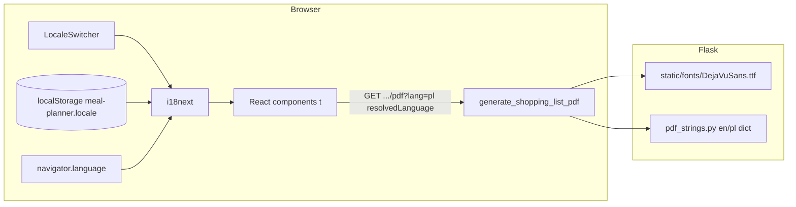
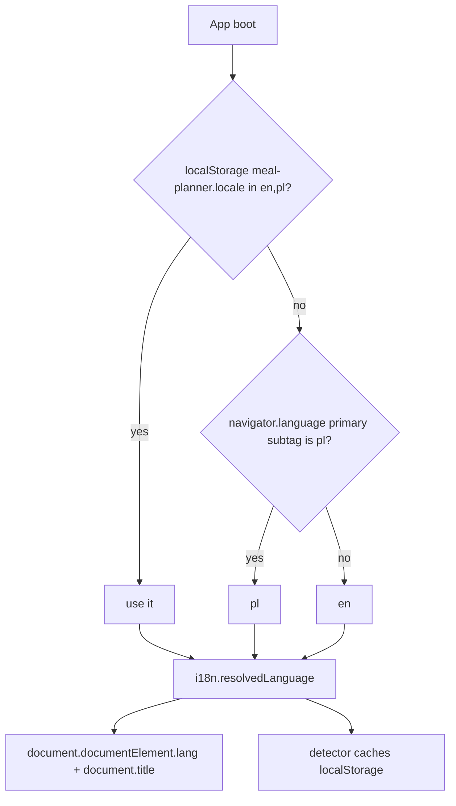

# Internationalization (i18n) of the Meal Planner App

**Author:** TBD  
**Date:** 2026-09-04  
**Status:** Draft (revised after design review)  
**Branch:** `docs/i18n-design`  
**Code snapshot:** `origin/main` @ `30460250` (`fix: import empty-instruction recipes and add meal-plan back link (#41)`)

---

## Overview

The Meal Planner is a single-user Flask + React Docker app. Recipe **content** is largely Polish (legacy `przepisy.csv` / `.odb` import of ~159 recipes), while all React chrome, empty states, confirmations, and PDF labels are hardcoded English. PDF export (`generate_shopping_list_pdf` in `meal_planner_app/services.py`) can drop Polish diacritics: it uses system DejaVu if `/usr/share/fonts/truetype/dejavu/DejaVuSans.ttf` exists, otherwise NFKD + latin-1 sanitization. Even the DejaVu path still NFKD-decomposes text, which is the wrong Unicode form for PDF TTF rendering of precomposed Latin Extended-A glyphs (`ą ć ę ł ń ó ś ź ż`).

This design adds **en + pl UI chrome** via `i18next` / `react-i18next`, a client-side locale switcher persisted in `localStorage` (first visit follows `navigator.language`), and **lossless Polish PDF** by bundling DejaVu TTFs and emitting NFC text. Stored user content (recipe names, instructions, ingredient names, units, locations) is **not** auto-translated.

---

## Background & Motivation

### Current state (verified in tree)

| Layer | Finding |
|---|---|
| React SPA | `frontend/package.json` has `react`, `react-dom`, `react-router-dom`, `axios`, `prop-types`. **No** `i18next`, `react-i18next`, or similar. |
| Flask | `pyproject.toml` depends on `Flask` + `fpdf2`. **No** Flask-Babel / Babel / gettext. |
| HTML | `frontend/index.html` is `<html lang="en">`. Title `"Meal Planner"` is hardcoded. |
| Auth | None. All routes open. No user profile, no per-user locale column. |
| Locale | No `Accept-Language` handling, no cookie, no env locale. |
| PDF | Docker images **do** install `fonts-dejavu-core` (`Dockerfile` line 50, `.devcontainer/Dockerfile` line 17). Native CI pytest (`setup-python` 3.9, no apt fonts) hits the Helvetica path. |
| Content | Legacy import is Polish (`docs/legacy_przepisy_schema.md`: `przepis`, `składniki`, `lokalizacje`, units like `ząbek`). Seed data (`seed_db.py`) is English (`Classic Pancakes`, `Simple Omelette`). Mixed-language catalogs are expected. |
| E2E | `frontend/playwright.config.js` sets `baseURL` + `screenshot` only — **no `locale`**. Ten tests locate English roles. |
| Docs | `.ai/progress.md` marks i18n **Partial**: “PDF: DejaVu if present, else NFKD/latin-1 sanitize”. `.ai/requirements.md` has NFR usability (2.2) but **no dedicated i18n FR**. Recommended next work item 8: “Proper i18n (stop relying on PDF sanitization).” |
| Docker context | Root `.dockerignore` lists a bare `LICENSE` (matches any path) and `*.md`. |

### Pain points

1. **Chrome vs content mismatch.** A Polish speaker importing `przepisy.csv` sees “Recipes / Create New Recipe / Loading recipes…” around Polish dish names. The inverse is also true after seeding: English recipes behind a Polish OS with no way to pick a UI language.
2. **PDF character loss.** `sanitize_for_pdf` NFKD-decomposes then `encode("latin-1", errors="ignore")`. `ę` → `e` + combining ogonek → combining mark dropped → `e`. `ł` similarly becomes `l`. Native pytest (no DejaVu) silently produces wrong PDFs. Tests decode PDF as latin-1 (`test_shopping_list_api.py` ~188–190) and never assert Polish glyphs; a sibling test already notes that “PDF content streams are compressed.”
3. **NFKD even with DejaVu.** `_pdf_text` still runs `unicodedata.normalize("NFKD", …)` when `has_unicode_font` is true. Combining marks often fail to render as a single glyph in fpdf2 TTF subsetting. Polish needs **NFC** (precomposed) code points that DejaVu actually contains.
4. **Quantity/unit bypass `_pdf_text`.** `_render_shopping_list_items` (`services.py` ~81–89) NFC/sanitizes `name` only. `quantity_str` and `unit` (e.g. `ząbek`) go to `cell()` raw. After bundling DejaVu this mostly works, but the helper must wrap **all** user text.
5. **Hardcoded strings everywhere.** ~120–150 user-visible English literals across 11 JSX files (`RecipeItem.jsx` has none — name only), plus PDF chrome in `services.py`, plus unattended defaults in `crud.py` (`f"Shopping List for {meal_plan.name}"` and `"New Shopping List"`). Playwright locates `"Recipes"`, `"Create New Recipe"`, `"Generate from Meal Plan"`, placeholders `'Ingredient name'` / `'Item name'`.
6. **Double-prefixed PDF titles.** Persisted-list PDF already does `Shopping List for: {shopping_list.name}` where `name` is often already `"Shopping List for {plan}"`. Localizing the prefix would make this worse unless the heading is separated from the stored name.
7. **No string workflow.** Adding a button means grepping JSX. There is no catalog, no plural rules, no `lang` update.

### Constraints that shape the design

- Single-user local Docker app. No multi-tenant i18n backend.
- React is the only HTML UI (`/ui/`; Jinja decommissioned).
- Docker-first: lockfile must be regenerated in `node:20-alpine`; fonts must work in `python:3.9-slim-bullseye` **and** in pytest without apt.
- Existing Playwright tests assume English chrome. **E2E is pinned to `use.locale: 'en-US'`** (PR-2). Real users still follow the browser on first visit. These are not in conflict.

---

## Goals & Non-Goals

### Goals (v1)

1. Translate **all UI chrome** (nav, headings, buttons, labels, placeholders, empty states, confirms, alerts, loading/error copy) to **English and Polish**.
2. Provide an explicit locale switcher; persist choice in `localStorage`; on first visit (no stored value) detect `navigator.language` (`pl*` → `pl`, else `en`).
3. Make shopping-list PDF **lossless for Polish** (and other Latin Extended-A) regardless of whether system DejaVu is installed. Bundle DejaVu TTFs. Stop NFKD + latin-1 stripping. Missing font → HTTP 500, never Helvetica.
4. Translate PDF **chrome** (heading, column headers, empty message) to the active locale via a `?lang=` query param on the existing PDF routes.
5. Format counts with proper **plural rules** (English `one`/`other`; Polish `one`/`few`/`many`/`other`).
6. Repeatable **string-addition workflow**: en is source of truth, pl in the same PR, **plural-aware key-parity CI that actually runs** (`npm run i18n:check` in the native frontend job and in the Docker frontend checks).
7. Keep stored **user content** in the language the user (or importer) wrote it. Display as-is.
8. Land incrementally in **strict PR order** (see PR Plan). Each PR independently reviewable; E2E stays green.

### Non-goals (v1)

- Machine-translating the ~159 imported recipes (names, instructions, ingredient names).
- RTL scripts, CJK, or a third locale.
- Flask-Babel / gettext for API error bodies.
- Per-user locale in SQLite (no auth, no profile).
- Translating freeform **units** and **locations** (`g`, `kg`, `szt`, `ząbek`, `mąki/wypieki`). Those are user/catalog data.
- Unit conversion (`g` ↔ `kg`) or locale-specific unit systems (US cups vs metric).
- Date/calendar formatting (meal plans have name + description only; no date range — FR-1.4.1 still missing).
- Translating seed data (`Classic Pancakes`) or E2E fixture names.
- Automatic `Accept-Language` negotiation that overrides an explicit `?lang=` or stored UI choice.
- A translation management SaaS (Crowdin, Lokalise). Two locales, ~150 keys, git is enough.

### Explicitly out of scope unless a later RFC argues otherwise

- Content-language field on `Recipe` / `MasterIngredient`.
- Server-side rendered translated HTML (there is none).
- Translating Flask `abort(400, description=…)` JSON for the SPA (the UI already maps most failures to its own chrome strings).
- **`MEAL_PLANNER_DEFAULT_LOCALE`, `GET /api/config`, `window.__MP_DEFAULT_LOCALE`, Vite `define`, or Flask-injected `index.html` locale.** First visit is browser language; operators who want Polish click PL once. A kiosk/env default is a later RFC with **one** injection mechanism, not three.

---

## Key Decisions

| # | Decision | Rationale |
|---|---|---|
| KD-1 | **Chrome only.** Do not auto-translate stored recipe/ingredient/plan/list content. | Content is user data. Imported Polish recipes and English seeds can coexist. MT of 159 recipes is lossy, unreviewable, and not requested. Search is already language-agnostic substring match (`crud.search_recipes`). |
| KD-2 | **`i18next` v23 + `react-i18next` v15 + `i18next-browser-languagedetector` v8.** JSON v4 plural suffixes. Resources imported at init — **no** `i18next-http-backend`. No Flask-Babel. `interpolation.escapeValue: false`. | All HTML is the React SPA. Official react-i18next guidance: React already escapes; leaving i18next’s default `true` shows `&#39;` in `confirm`/`alert`/`prompt`. PDF needs ~5 strings — a Python dict is enough. Exact minors locked by `npm` in `node:20-alpine` during PR-2. |
| KD-3 | **Semantic keys** (`nav.recipes`, `recipes.create`), not English-as-key. | English copy will change; Polish plurals need extra forms; keys stay stable for E2E helpers later. |
| KD-4 | **Locale resolution (v1, only chain):** `localStorage['meal-planner.locale']` if in `{en,pl}` → else `navigator.language` primary subtag `pl` → `pl` else `en` → hard fallback `en`. Detector `order: ['localStorage','navigator']` only (no querystring, cookie, `htmlTag`). | No auth. Explicit switcher must win. `htmlTag` would pin `<html lang="en">` forever. Env/`/api/config`/`window.__MP_*` are out of scope (see Non-goals). |
| KD-5 | **Persist only in `localStorage`** under `meal-planner.locale` (not the detector default `i18nextLng`). No cookie, no SQLite column. | Single-user, same browser. Cookie would leak onto PDF requests without buying much. Future auth can copy the value into a user row. |
| KD-6 | **Bundle DejaVuSans + DejaVuSans-Bold** in `meal_planner_app/static/fonts/`. Prefer bundled file via `importlib.resources`; fall back to system path; **if neither exists, raise and Flask `abort(500)`**. Never Helvetica, never latin-1 strip. License is **Bitstream Vera + Arev + public-domain modifications**, not OFL. Ship as `DejaVu.LICENSE` (not `LICENSE` — `.dockerignore` has a bare `LICENSE` pattern). | `package-data` already ships `static/**/*`. Native CI has no `fonts-dejavu-core`. ~1.5 MB is acceptable vs silent data loss. Docker may keep the apt package as spare. |
| KD-7 | **NFC, not NFKD.** Delete `sanitize_for_pdf` from production. Apply NFC to **name, quantity, unit, location, and title**. | Precomposed Polish glyphs exist in DejaVu. NFKD + latin-1 is how `ł` becomes `l`. Units like `ząbek` currently skip `_pdf_text`. |
| KD-8 | **PDF locale:** query `lang` (whitelist `en`/`pl`, case-insensitive) → `request.accept_languages.best_match(["en", "pl"]) or "en"`. SPA href uses `i18n.resolvedLanguage`. | Werkzeug is already a Flask dependency; q-values work (`pl;q=0.2, en;q=0.9` → `en`). No custom parser. `i18n.language` can be `pl-PL` and would fail the whitelist. |
| KD-9 | **Unattended `crud.py` defaults stay English** (`"Shopping List for {plan.name}"` and `"New Shopping List"`). A **user-confirmed** `window.prompt` value is user content and may be stored in the UI language. PDF uses a translated **heading** plus the raw stored name as subtitle — never `"Shopping List for: {name}"` prefix. | Persisting a translated unattended default freezes locale at creation. The current prefix already double-titles persisted lists. |
| KD-10 | **v1 locales: `en` (source) + `pl` only.** One `common` JSON per locale. **Serial PRs** that touch that file (PR-3 then PR-4). Split namespaces later if keys exceed ~200. | Parallel PRs on one JSON file are not independently mergeable. |
| KD-11 | **E2E pinned to English via Playwright `use.locale: 'en-US'`** in PR-2. Do not seed `meal-planner.locale`. PL smoke clicks `data-testid="locale-pl"`. Real users still follow the browser on first visit. | Current config has no `locale`; a `LANG=pl_PL` host or image would fail all 10 English locators the moment the detector lands. Pinning Playwright is not the same as disabling detection. |
| KD-12 | **No `Intl` date/number overhaul in v1.** Use i18next `count` for plurals only. Quantities/units render as stored. | No calendar. Quantities are mixed `float` / `str` / `list` (`"to taste"`). Forcing `Intl.NumberFormat` would change `"1.5"` vs `"1,5"` in the middle of freeform strings. |

---

## Proposed Design

### High-level architecture



No `/api/config`. Flask learns the UI locale only from `?lang=` (or `Accept-Language` for curl).

### Locale resolution (v1 — only chain)



Coercion: take the primary subtag, lowercase, whitelist `{en, pl}`, else `en`. Implemented by i18next `supportedLngs` + `load: 'languageOnly'` (so `pl-PL` → `pl`, `PL-pl` → `pl`, `fr` → fallback `en`). Invalid stored values are overwritten by the fallback on init.

**E2E:** Playwright `use.locale: 'en-US'` makes `navigator.language` English, so the same chain yields `en` without seeding storage. Production users on a Polish OS get `pl` on first visit; the switcher can override either way.

### Frontend structure

New files (paths are the contract; this RFC does not implement them):

```
frontend/src/i18n/
  index.js                 # init block below; export i18nReady Promise
  config.js                # SUPPORTED = ['en','pl'], STORAGE_KEY = 'meal-planner.locale'
  locales/
    en/common.json
    pl/common.json
frontend/src/components/
  LocaleSwitcher.jsx
frontend/scripts/
  check-i18n-keys.mjs      # plural-aware parity + count snapshot
```

`frontend/src/main.jsx` **awaits** `i18nReady` before `createRoot`, so `document.documentElement.lang` and `document.title` are set before first paint (avoids `index.html` `lang="en"` / `"Meal Planner"` racing `toHaveTitle` and AT).

```javascript
// frontend/src/i18n/index.js — copy-pasteable contract
import i18n from "i18next";
import { initReactI18next } from "react-i18next";
import LanguageDetector from "i18next-browser-languagedetector";
import en from "./locales/en/common.json";
import pl from "./locales/pl/common.json";
import { STORAGE_KEY, SUPPORTED } from "./config";

function applyDocumentLocale(lng) {
  const short = (lng || "en").split("-")[0].toLowerCase();
  const resolved = SUPPORTED.includes(short) ? short : "en";
  document.documentElement.lang = resolved;
  document.title = i18n.t("app.title");
}

export const i18nReady = i18n
  .use(LanguageDetector)
  .use(initReactI18next)
  .init({
    resources: {
      en: { common: en },
      pl: { common: pl },
    },
    fallbackLng: "en",
    supportedLngs: SUPPORTED,
    load: "languageOnly",
    nonExplicitSupportedLngs: true,
    ns: ["common"],
    defaultNS: "common",
    interpolation: { escapeValue: false }, // React escapes; needed for confirm/alert/prompt
    detection: {
      order: ["localStorage", "navigator"],
      caches: ["localStorage"],
      lookupLocalStorage: STORAGE_KEY,
    },
  })
  .then(() => applyDocumentLocale(i18n.resolvedLanguage));

i18n.on("languageChanged", applyDocumentLocale);

export default i18n;
```

```javascript
// frontend/src/main.jsx
import "./i18n";
import { i18nReady } from "./i18n";
import React from "react";
import ReactDOM from "react-dom/client";
import App from "./App.jsx";
import "./index.css";

i18nReady.then(() => {
  ReactDOM.createRoot(document.getElementById("root")).render(
    <React.StrictMode>
      <App />
    </React.StrictMode>,
  );
});
```

Versions (PR-2, verify in `node:20-alpine` then lock):

| Package | Range to install | Why |
|---|---|---|
| `i18next` | `^23.16.0` | JSON v4 suffixes `_one` / `_few` / `_many` / `_other` |
| `react-i18next` | `^15.0.0` | React 18; pairs with i18next 23 |
| `i18next-browser-languagedetector` | `^8.0.0` | `lookupLocalStorage` / `caches` as used above |

Do **not** add `i18next-http-backend`. JSON is bundled by Vite. A runtime fetch of `/locales/{{lng}}/common.json` would 404 under Flask’s `/ui/` static layout.

`Layout.jsx` renders `LocaleSwitcher` on the right of the existing `<nav className="bg-gray-800">` flex row. A Layout `useEffect` that re-applies `lang`/`title` is a **backstop only**; init + `languageChanged` are the source of truth.

**LocaleSwitcher a11y:** two `<button type="button">` elements (`EN`, `PL`) in a group:

- Group: `role="group"` + `aria-label={t('nav.language')}` (e.g. “Language” / “Język”).
- Each button: `data-testid="locale-en"` / `locale-pl`, `aria-pressed={resolved === 'en'}`, `lang="en"` / `lang="pl"` on the visible label so AT pronounces it correctly, `aria-label={t('nav.languageEn')}` / `t('nav.languagePl')` if the visible text is just “EN”.
- Keyboard: native buttons (Tab, Enter/Space). No custom widget.

`LocaleSwitcher` is the only component that calls `i18n.changeLanguage`. Pass the short code (`'en'` / `'pl'`), never `pl-PL`.

PDF download href (PR-5 only):

```jsx
href={`/shopping-lists/${shoppingList.id}/pdf?lang=${i18n.resolvedLanguage}`}
```

### Example keys (illustrative — not the catalog)

The JSON sample is a shape example. PR-3/PR-4 extract from the inventory table (and grep), not from this block. `RecipeItem.jsx` has no chrome.

```json
{
  "app.title": "Meal Planner",
  "nav.recipes": "Recipes",
  "nav.ingredients": "Ingredients",
  "nav.mealPlans": "Meal Plans",
  "nav.shoppingLists": "Shopping Lists",
  "nav.language": "Language",
  "nav.languageEn": "English",
  "nav.languagePl": "Polish",
  "common.loading": "Loading…",
  "common.error": "Error: {{message}}",
  "common.edit": "Edit",
  "common.delete": "Delete",
  "common.cancel": "Cancel",
  "common.save": "Save",
  "common.search": "Search",
  "common.clear": "Clear",
  "common.back": "Back",
  "recipes.title": "Recipes",
  "recipes.create": "Create New Recipe",
  "recipes.empty": "No recipes found.",
  "ingredients.usedCount_one": "Used in {{count}} recipe",
  "ingredients.usedCount_other": "Used in {{count}} recipes",
  "shopping.downloadPdf": "Download PDF",
  "shopping.generateFromPlan": "Generate from Meal Plan",
  "shopping.newListDefault": "New Shopping List",
  "shopping.namePrompt": "Enter name for new shopping list:"
}
```

Polish plurals use i18next JSON v4 suffixes `_one`, `_few`, `_many`, `_other` (`Intl.PluralRules('pl')`). Ingredient usage line (masculine *składnik* / *używany*):

```json
{
  "ingredients.usedCount_one": "Używany w {{count}} przepisie",
  "ingredients.usedCount_few": "Używany w {{count}} przepisach",
  "ingredients.usedCount_many": "Używany w {{count}} przepisach",
  "ingredients.usedCount_other": "Używany w {{count}} przepisach"
}
```

`IngredientList.jsx` currently interpolates in JS: `` `Used in ${count} recipe${count !== 1 ? "s" : ""}` `` — that **must** become `t('ingredients.usedCount', { count })`. Do not keep English pluralization in component code.

### String inventory (chrome to extract)

All of these are hardcoded today. User content (`recipe.name`, `ingredient.name`, `plan.description`, stored list `name`, etc.) is **not** extracted. This table is the extraction checklist for PR-3/PR-4; the JSON sample above is not.

| File | Chrome (extract) | Skip |
|---|---|---|
| `Layout.jsx` | Recipes, Ingredients, Meal Plans, Shopping Lists | — |
| `RecipeList.jsx` | heading, Create New Recipe, Search term…, Filter by ingredient…, Search, Clear, Loading recipes…, Error loading recipes, No recipes found. | recipe names |
| `RecipeDetail.jsx` | confirm/delete copy, Recipe not found, Back to Recipes, Source, Ingredients, No ingredients listed, Instructions, Edit Recipe, Delete Recipe | recipe fields |
| `RecipeForm.jsx` | validation alert, Edit/Create New Recipe, labels, placeholders (Ingredient name, Quantity, Unit, Location), Remove, Add Ingredient, Update/Create Recipe, Cancel | field values |
| `IngredientList.jsx` | loading/error/empty, Ingredients, Add new ingredient, Used in N recipe(s), `unit:` label | ingredient names, stored units/locations |
| `IngredientDetail.jsx` | **do not extract in v1** (unrouted dead code) | whole file |
| `RecipeItem.jsx` | none | recipe.name |
| `MealPlanList.jsx` | Meal Plans, New Meal Plan, empty/loading/error | plan names |
| `MealPlanDetail.jsx` | delete confirm, Back to Meal Plans, Recipes, No recipes in this meal plan, Edit, Delete | plan/recipe names, `x {count}` |
| `MealPlanForm.jsx` | Create/Edit Meal Plan, Name, Description, Recipes, -- Select a recipe --, Times:, Remove, + Add Recipe, fraction help, Update/Create, Cancel | selected recipe names |
| `ShoppingListView.jsx` | ~30 strings: headings, prompts, confirms, alerts, “from meal plan” / “standalone”, Download PDF, placeholders Qty / Item name, `newListDefault` **prompt default only** | stored list names, item names/qty/unit |
| `services.py` | heading, Ingredient, Quantity, Unit, empty message, N/A | item fields; location labels are user text |
| `crud.py` | **do not localize stored defaults** (KD-9) | `"Shopping List for {name}"`, `"New Shopping List"` |

`window.confirm` / `alert` / `prompt` strings are chrome and **are** translated (`t('recipes.deleteConfirm', { name: recipe.name })` — `name` is untranslated user content interpolated into a translated template). With `escapeValue: false`, quotes in names appear as real quotes in `confirm()` (React still escapes JSX).

### PDF generation

Current flow (`meal_planner_app/services.py`):

```
generate_shopping_list_pdf(title, grouped_data)
  → if DejaVu exists at hardcoded /usr/share/fonts/... → add_font
  → else Helvetica + sanitize_for_pdf (NFKD + latin-1 ignore)
  → even DejaVu path: NFKD
  → name goes through _pdf_text; quantity and unit do not
```

Target flow:

```mermaid
sequenceDiagram
  participant SPA
  participant Flask as main.py
  participant Svc as services.py
  participant Font as importlib.resources fonts

  SPA->>Flask: GET /shopping-lists/{id}/pdf?lang=pl
  Flask->>Flask: whitelist lang else accept_languages.best_match else en
  Flask->>Svc: generate_shopping_list_pdf(title, data, lang="pl")
  Svc->>Font: bundled DejaVuSans.ttf then system path
  alt missing both
    Svc-->>Flask: FontUnavailableError
    Flask-->>SPA: 500
  else found
    Svc->>Svc: NFC(name, qty, unit, location, title)
    Svc->>Svc: translated heading + headers from pdf_strings[lang]
    Svc-->>Flask: bytes
    Flask-->>SPA: application/pdf; filename*=UTF-8''...
  end
```

Font resolution (first hit wins):

1. `importlib.resources.files("meal_planner_app") / "static" / "fonts" / "DejaVuSans.ttf"` (and `-Bold.ttf`). Prefer this over `Path(__file__)` so the files are found from a wheel/sdist, not only an editable checkout.
2. `/usr/share/fonts/truetype/dejavu/DejaVuSans.ttf` (current Docker apt path).
3. If neither pair exists: raise `FontUnavailableError`. `main.py` maps it to `abort(500)`. **No Helvetica. No latin-1. No “log and continue.”** Tests without the bundled files must fail.

Text pipeline:

- Every user-supplied string drawn in the PDF (title/subtitle, item **name, quantity, unit, location**, empty-state is chrome not user text): `unicodedata.normalize("NFC", str(text or ""))`. No `encode`.
- Chrome from `meal_planner_app/i18n/pdf_strings.py` (plain dicts; no gettext). Keys at minimum: `heading`, `col_ingredient`, `col_quantity`, `col_unit`, `empty`, `na`.
- Empty-list message currently **bypasses** `_pdf_text`. It must go through the Unicode font + translation path.
- Location grouping decoration: keep punctuation-only (`--- {nfc(loc)} ---`) or drop the dashes; `{loc}` is user text, not chrome.

**PDF title layout (KD-9):**

```
[translated heading, 16pt bold]     e.g. "Shopping List" / "Lista zakupów"
[stored name subtitle, 12pt]        e.g. "Shopping List for Weekly Meal Plan"
                                     or user-chosen "Żurek na weekend"
[column headers, translated]
```

Do **not** use `f"Shopping List for: {name}"`. That double-prefixes persisted lists today and would become `Lista zakupów: Shopping List for …` after PR-5.

Filename (`main.py` `_pdf_attachment_response`) — **PR-5 only**, not PR-1:

ASCII `filename=` will mangle `Żurek`. Use RFC 5987:

```
Content-Disposition: attachment; filename="shopping_list.pdf"; filename*=UTF-8''shopping_list_%C5%BBurek.pdf
```

Keep a conservative ASCII `filename=` fallback (`shopping_list.pdf`) plus `filename*` for a percent-encoded UTF-8 name derived from the stored list title (strip CR/LF). English stem `shopping_list_` stays (Open Question 2).

fpdf2: `add_font("DejaVu", "", path)` is Unicode in fpdf2 2.x. After adding the font, `cell`/`multi_cell` accept `str`.

**License / provenance (PR-1 must record in the commit message and next to the files):**

- Fonts: **DejaVu Sans** (regular + bold), matching the files Docker already installs as `fonts-dejavu-core`.
- Upstream: https://github.com/dejavu-fonts/dejavu-fonts/releases — pin the **exact release tag** in PR-1 (e.g. `version 2.37`; confirm at implementation time).
- Preferred source of the two TTFs: the same Debian package the image uses (`fonts-dejavu-core`) **or** that upstream release — state which in the PR-1 description so the glyphs match Docker metrics.
- License: Bitstream Vera + Arev + DejaVu public-domain changes. **Not SIL OFL** (Noto Sans is OFL; we are not shipping Noto).
- Ship copyright text as `meal_planner_app/static/fonts/DejaVu.LICENSE` (unique name).
- `.dockerignore`: add `!meal_planner_app/static/fonts/` so a future `LICENSE` rename cannot be excluded by the bare `LICENSE` pattern; TTFs are not matched by `LICENSE`/`*.md` today.

Do not subset in v1 (~757 KB × 2).

Docker: keep `fonts-dejavu-core` as spare; the bundle is the source of truth.

### Date / number / unit formatting

| Data | v1 behavior |
|---|---|
| Recipe / plan / list names | Stored string, as-is |
| Quantities | `String(quantity)` as today (`_format_quantity` joins lists with `", "`). No `Intl.NumberFormat`. NFC before PDF. |
| Units | Stored (`cups`, `g`, `szt`, `ząbek`). Not translated. NFC before PDF. |
| Locations | Stored. PDF grouping headers are user text. |
| Counts (`usage_count`, recipe multipliers `x {count}`) | i18next `count` for prose; multiplier stays `x {count}` with the raw number. |
| Dates | None in the model. When FR-1.4.1 lands, use `Intl.DateTimeFormat(locale)` then. |

Polish decimal comma is **not** applied to stored quantities. Changing `1.5` cups to `1,5` would break edit-round-trip and unit tests.

### How new strings get added (workflow)

1. Add the key to `frontend/src/i18n/locales/en/common.json` (source of truth, English).
2. Add the same **base** key to `pl/common.json` in the **same PR**, including every CLDR category required for `pl` (`_one`, `_few`, `_many`, `_other` for plurals). Untranslated keys are a CI failure, not a follow-up.
3. Use `const { t } = useTranslation();` and `t('recipes.create')`. Interpolation: `t('recipes.deleteConfirm', { name })`. Plurals: `t('ingredients.usedCount', { count })`.
4. Never concatenate translated fragments (`t('usedIn') + count + t('recipes')`) — Polish grammar will break.
5. PDF chrome: add the key to **both** dicts in `meal_planner_app/i18n/pdf_strings.py`.
6. **CI (wired in PR-2, not “later”):** `npm run i18n:check` → `node scripts/check-i18n-keys.mjs`:
   - Flatten nested JSON.
   - Strip plural suffixes `_zero|_one|_two|_few|_many|_other` to get **base** keys.
   - Every en base key exists in pl; every pl base key exists in en.
   - For each locale, every plural base key has the CLDR categories required for that language (`en`: `_one`+`_other`; `pl`: `_one`+`_few`+`_many`+`_other`).
   - Snapshot `i18n.t('ingredients.usedCount', { count, lng })` for counts `0,1,2,5,22` in both `en` and `pl` (catches `2 przepis` vs `2 przepisy`). Until PR-3 adds that key, the script may skip the snapshot if the key is absent, or PR-2 can ship a stub `ingredients.usedCount_*` used only by the checker. Prefer a stub in PR-2 so the snapshot runs from day one.
7. Hook the script:
   - `frontend/package.json`: `"i18n:check": "node scripts/check-i18n-keys.mjs"`.
   - `.github/workflows/ci.yml` frontend job: `npm run i18n:check` after `npm ci` (alongside lint / format-check).
   - `AGENTS.md` Docker frontend checks: add `npm run i18n:check`.
8. Optional later: `i18next-parser` to list JSX literals. **Not** `eslint-plugin-i18next` `no-literal-string` in v1 (too noisy on `className`, test ids, API paths).
9. Do not run Prettier on JSON key order inconsistently — keep keys sorted (`prettier` already formats JSON; `frontend/.prettierignore` must **not** ignore `src/i18n/locales`).

### `data-testid` convention

Add stable selectors so E2E can stop depending on visible copy:

| Control | `data-testid` |
|---|---|
| Nav Recipes | `nav-recipes` |
| Nav Ingredients | `nav-ingredients` |
| Nav Meal Plans | `nav-meal-plans` |
| Nav Shopping Lists | `nav-shopping-lists` |
| Locale EN | `locale-en` |
| Locale PL | `locale-pl` |
| Create recipe | `recipes-create` |
| Search submit | `recipes-search` |
| Generate from plan | `shopping-generate` |
| Download PDF | `shopping-pdf` |

Existing `getByRole({ name: "Recipes" })` remains valid because Playwright is pinned to `en-US`.

### Tests

**Pytest (PDF) — PR-1 binds this (no “or”):**

1. **Font miss:** raise `FontUnavailableError` → Flask `abort(500)`. Unit-test the resolver by pointing it at a missing path (monkeypatch); do not keep a Helvetica branch to test.
2. **Purchased-exclusion:** assert at the **data** layer (`crud.shopping_list_to_pdf_data` omits purchased items), same pattern as the location-id grouping test. **Do not** `decode("latin-1")` the PDF body. Rewrite `test_download_persisted_pdf_excludes_purchased` accordingly; the latin-1 grep is not valid once DejaVu subsetting is always on.
3. **Glyph/font tests** (new `meal_planner_app/tests/test_pdf.py`):
   - (a) bundled TTF is reachable via `importlib.resources.files("meal_planner_app") / "static/fonts/DejaVuSans.ttf"`.
   - (b) font resolver returns that path when the bundle exists.
   - (c) `_pdf_text` (or successor) returns NFC and never calls `encode(..., errors="ignore")`.
   - (d) after `generate_shopping_list_pdf(...)`, the FPDF instance / output path used `DejaVu` (inspect `pdf.fonts` / font family before `output()`, or a test seam that returns the family).
   - (e) optional: `pdf.set_compression(False)` and search ToUnicode/UTF-16BE for `Żurek` / `ąęćłńóśźż`. Nice-to-have, not the only gate.
4. NFC **quantity and unit** as well as name/location (regression for `ząbek`).
5. HTTP happy path still asserts `200`, `application/pdf`, `%PDF` magic. It does **not** claim ASCII names appear as latin-1 literals in the stream.
6. Delete `sanitize_for_pdf` (or keep the function body only if a test proves production no longer calls it — prefer delete).

**Pytest (PDF chrome) — PR-5:**

- `lang="pl"` → Polish headers from `pdf_strings`.
- `lang="en"` → `Ingredient` / `Quantity` / `Unit`.
- `lang=fr` or missing → `en` (or `Accept-Language` if tested via HTTP).
- Empty list uses translated empty copy and DejaVu.
- Heading is the translated chrome string; stored name is a separate subtitle.

**Playwright:**

- `playwright.config.js` `use.locale: 'en-US'` (PR-2). No seeded `meal-planner.locale`.
- Existing 10 tests stay as they are (English roles).
- PR-6: click `getByTestId('locale-pl')`; expect `getByTestId('nav-recipes')` text `/Przepisy/`; `document.documentElement.lang === 'pl'`; reload → still `pl`.
- PR-6 (after PR-5): Download PDF `href` contains `lang=pl` when locale is pl.

**Frontend unit tests:** still missing (progress.md). Do not block i18n on Jest. The node `i18n:check` script is the chrome-level gate.

---

## API / Interface Changes

### PDF routes (existing paths, new query param — PR-5)

```
GET /shopping-lists/<uuid>/pdf?lang=pl
GET /meal-plans/<uuid>/shopping-list/pdf?lang=pl
```

Resolution, in order:

1. `lang` query param if its lowercase value is in `{en, pl}`.
2. Else `request.accept_languages.best_match(["en", "pl"]) or "en"` (Werkzeug; honors q-values).
3. Else `"en"`.

- Response: `application/pdf` as today. `Content-Disposition` gains `filename*` in PR-5.
- `generate_shopping_list_pdf(meal_plan_name, shopping_list_data, lang="en")` — third arg added with default so direct callers keep working. `lang` does not exist in PR-1 (chrome stays English); PR-5 adds it.

SPA change in `ShoppingListView.jsx` **only in PR-5**:

```jsx
href={`/shopping-lists/${shoppingList.id}/pdf?lang=${i18n.resolvedLanguage}`}
```

### JSON CRUD API

**No change.** Recipe/ingredient/plan/list payloads remain `{ name, instructions, … }` in the user’s language. No `locale` field. No `/api/config`.

Flask `abort(400, description="\`name\` and \`instructions\` are required.")` stays English in v1. The SPA rarely surfaces the description (it throws `"Failed to save recipe"` etc., which **are** translated as chrome).

Unattended create-without-name still stores `"New Shopping List"` / `"Shopping List for {plan}"` in English (KD-9).

### React public interface

```js
import { useTranslation } from "react-i18next";

const { t, i18n } = useTranslation();
t("nav.recipes");
i18n.changeLanguage("pl"); // LocaleSwitcher only; short code
// PDF href: i18n.resolvedLanguage  // 'en' | 'pl', never 'pl-PL'
```

---

## Data Model Changes

**None for v1.**

SQLite schema (`ingredients`, `recipes`, `recipe_ingredients`, `meal_plans`, `meal_plan_recipes`, `shopping_lists`, `shopping_list_items`, `schema_version = 1`) is unchanged. No `locale` column. No content translation table.

User content remains a single UTF-8 string per field. SQLite and Flask JSON already round-trip Polish (the migration work on `fix/migration-polish-signs` was about **import encoding**, which is a separate, already-landed concern).

### Future (not v1)

When auth lands, a `users.preferred_locale TEXT` defaulting to `en` can override `localStorage` after login. Until then, localStorage is the profile.

A later `recipes.content_language` would only be for search ranking / MT, which we are not doing.

A later kiosk default would be **one** of: Flask `GET /api/config` from env, **or** Vite `import.meta.env.VITE_DEFAULT_LOCALE` — pick then, not both.

### Migration strategy

N/A. Feature-flag-free deploy: new JS bundle + font files. Old PDFs already downloaded are static files on disk; newly generated PDFs pick up the font immediately.

---

## Alternatives Considered

### A. react-i18next vs. custom JSON map vs. Flask-Babel

| Option | Pros | Cons |
|---|---|---|
| **react-i18next (chosen)** | Plurals, interpolation, detector, huge ecosystem, lazy namespaces later | New frontend deps; lockfile regen in Docker |
| Hand-rolled `t = dict[lang][key]` | Zero deps | Reimplement plurals (Polish has 4 forms), detector, `lang` updates; worse than the problem |
| Flask-Babel + gettext | Standard for Jinja | **Jinja is gone.** Would translate API errors nobody shows. `.po` compile step in Docker. SPA would still need a JS library |

### B. Font bundling vs. system DejaVu vs. keep sanitizing

| Option | Pros | Cons |
|---|---|---|
| **Bundle TTF (chosen)** | Deterministic in pytest, lossless without apt | ~1.5 MB; must ship Bitstream Vera license under a non-`LICENSE` filename |
| System DejaVu only (status quo) | Already in Dockerfiles | Native CI / host pytest still sanitize; easy to drop apt and not notice |
| Keep NFKD/latin-1 fallback | Never crashes Helvetica | **This is the bug.** Silent data loss of `ąęćłńóśźż` |
| Bundle a subset (Latin Extended-A only) | Smaller | Extra fonttools pipeline; easy to drop a needed glyph (`—`, `…`) |
| Noto Sans (OFL) | Broader script coverage; OFL is simpler to name | Different metrics than the Docker DejaVu operators already see; CJK is a non-goal |

### C. Locale storage: localStorage vs. cookie vs. env-only vs. SQLite

| Option | Pros | Cons |
|---|---|---|
| **localStorage (chosen)** | No backend; survives reload; doesn’t affect PDF until we pass `?lang=` | Per-browser, not per-user; invisible to Flask unless query param |
| Cookie | Auto-sent to PDF routes | CSRF-irrelevant here but couples HTTP to locale; need SameSite; more moving parts |
| Env only | Simple kiosk | No runtime switcher; every user of the container shares one language; **deferred** |
| SQLite user row | Real profile | **No users.** Schema change for one column nobody can set |

### D. Auto-translate stored recipes (rejected)

MT (DeepL/Google) of 159 recipes would (a) need an API key, (b) mutate or duplicate user data, (c) destroy culinary terms (`zacieranie`, `zakwas`), (d) make search/identity ambiguous. A bilingual catalog is fine: chrome in the user’s language, content in the author’s. If a future owner wants translation, it should be an explicit “duplicate recipe as EN” action, not a silent background job.

### E. English-as-key vs. semantic keys

English-as-key (`t("Create New Recipe")`) is faster to migrate and keeps E2E names aligned, but Polish plurals and copy edits break keys. Semantic keys (chosen) plus `data-testid` is the durable pair.

### F. Disable navigator detection until PR-6 (rejected)

Would keep E2E green without `use.locale`, but contradicts Goal 2 (first-visit browser language) and would ship a switcher-only product until the last PR. Pinning Playwright locale is the smaller, local fix.

---

## Security & Privacy Considerations

| Topic | Notes |
|---|---|
| Threat model | Single-user, no auth, local Docker. i18n does not expand the attack surface much. |
| XSS via interpolation | **`interpolation.escapeValue: false`** because React escapes JSX. **Do not** use `Trans` with raw HTML from recipe instructions. Instructions stay in `{recipe.instructions}` text nodes (`whitespace-pre-wrap`) as today. `confirm`/`alert`/`prompt` receive real Unicode, not `&#39;`. |
| Lang query param | Whitelist `en`/`pl`. Ignore anything else (fall through to Accept-Language). No path injection. |
| Font files | Static TTFs vendored from DejaVu; do not load fonts from user URLs. |
| Privacy | `localStorage` locale is not PII. `navigator.language` is not sent to the server. PDF `?lang=` is the only locale bit on the wire. |
| Content-Disposition | RFC 5987 `filename*`; do not reflect unsanitized newlines from list titles into headers. ASCII `filename="shopping_list.pdf"` fallback; UTF-8 percent-encode `filename*`. |

---

## Observability

This is a local app with no metrics backend. Keep it lightweight:

- **Logs (Flask):** one `INFO` line per PDF: `pdf lang=pl font=bundled items=12`. `ERROR` if no TTF resolved (then 500).
- **No PII:** do not log recipe or list names at INFO.
- **Frontend:** no analytics. Optional `console.debug` in dev when language changes.
- **CI as observability:** `npm run i18n:check` + PDF font/NFC tests are the regression alarms.
- **Alerting:** none. If we ever add Sentry, tag `locale`.

---

## Rollout Plan

No feature flag framework exists. Roll out by **strict PR order** (see PR Plan). Each slice ships to `main` independently.

1. **PR-1 PDF fonts** before any JS i18n. Fixes the data-loss bug for Polish shopping lists in Docker **and** pytest. Rollback: revert; images still have apt DejaVu.
2. **PR-2 scaffolding** adds deps + switcher + nav + Playwright `locale: 'en-US'` + `i18n:check` in CI. Rollback: revert; lockfile reverts with it.
3. **PR-3 then PR-4** chrome extraction (serial: both edit `common.json`).
4. **PR-5** PDF chrome `?lang=` + `filename*` + SPA href. Old clients omit `lang` → English headers via `best_match` or `en`.
5. **PR-6** E2E PL smoke + `.ai/` trackers.

**Rollback:** git revert of the SHA. No DB migration to undo. Users with `localStorage` set to `pl` after a chrome revert see English keys (i18next fallback); leftover localStorage is harmless.

**Staged rollout:** N/A (single-user). No env default in v1.

**Risk register**

| Risk | Severity | Mitigation |
|---|---|---|
| Playwright locators break if host/CI locale is `pl` | High | PR-2 sets `use.locale: 'en-US'`; do not seed `meal-planner.locale`; detector still on for real users |
| Polish plurals wrong (`2 przepis` vs `2 przepisy`) | Medium | JSON v4 suffixes; `i18n:check` snapshots counts `0,1,2,5,22` |
| Bundled font missing from sdist/wheel/Docker context | High | `importlib.resources` test; `DejaVu.LICENSE` not `LICENSE`; `.dockerignore` negation |
| NFKD leftover / Helvetica branch | High | Delete `sanitize_for_pdf`; font miss is 500 |
| Lockfile drift after adding i18next | High | Regen with `node:20-alpine` per AGENTS.md; `npm ci` in bake |
| Compressed PDF tests can’t see Polish / ASCII names | High | Rewrite purchased-exclusion to data layer; do not grep latin-1 streams |
| `common.json` merge conflicts | Medium | Serial PR-3 → PR-4; one namespace (KD-10) |
| `IngredientDetail.jsx` dead code translated then deleted | Low | Skip extracting it until master-ingredient UI routes it |
| First-paint `lang=en` flash | Low | Await `i18nReady` before `createRoot` |

---

## Open Questions

Resolved during review (kept here so the next agent does not re-litigate them):

1. **Forced default locale / `/api/config` / `window.__MP_DEFAULT_LOCALE`?** **No in v1.** Browser detection + switcher only (KD-4). Later RFC may pick **one** injection mechanism.
2. **`crud` default list names?** **Unattended English; user-confirmed prompt is content; PDF heading is separate chrome** (KD-9).
3. **`IngredientDetail.jsx`?** **Skip until routed.**
4. **Disable navigator detector to protect E2E?** **No.** Pin Playwright `locale` instead (KD-11, Alternative F).

Still open (do not block PR-1/PR-2):

1. **PDF filename stem.** Keep `shopping_list_*.pdf` (English) or localize (`lista_zakupow_*.pdf`)? **Recommendation:** keep English stem; UTF-8 `filename*` carries the list title.
2. **Playwright `data-testid` vs. `getByRole` long-term?** **Recommendation:** introduce test ids now; migrate existing tests opportunistically, not in a big-bang.
3. **Should API 4xx descriptions be translated later?** Only if the SPA starts rendering `response.json().description`. Today it does not.
4. **DejaVu vs Noto Sans.** **Recommendation:** DejaVu for v1 (metric parity with Docker). Revisit only if we add scripts DejaVu cannot render.

---

## References

- `.ai/progress.md` — i18n status **Partial**; recommended work item 8.
- `.ai/requirements.md` — NFR 2.2 Usability; no i18n FR.
- `.ai/stack.md` — fpdf2; “Optional DejaVu (`fonts-dejavu-core` in images); otherwise latin-1 sanitization”.
- `meal_planner_app/services.py` — `sanitize_for_pdf`, `generate_shopping_list_pdf`; quantity/unit skip `_pdf_text`.
- `meal_planner_app/main.py` — `_pdf_attachment_response`, PDF routes.
- `meal_planner_app/crud.py` — `list_name = name or f"Shopping List for {meal_plan.name}"` (~533); standalone `name or "New Shopping List"` (~541).
- `Dockerfile` / `.devcontainer/Dockerfile` — `apt-get install -y … fonts-dejavu-core`.
- `.dockerignore` — bare `LICENSE` and `*.md`.
- `.github/workflows/ci.yml` — frontend job is `npm ci` + lint + format-check only (until PR-2 adds `i18n:check`).
- `frontend/playwright.config.js` — no `locale` today.
- `frontend/src/components/*.jsx` — hardcoded English chrome.
- `frontend/e2e/main.spec.js` — English role locators.
- `frontend/index.html` — `lang="en"`.
- `docs/legacy_przepisy_schema.md` — Polish source schema, ~159 recipes.
- `docs/superpowers/specs/2026-09-04-persistent-sqlite-dao-design.md` — persistence; no locale column.
- [i18next](https://www.i18next.com/) / [react-i18next](https://react.i18next.com/) (escapeValue: false)
- [CLDR Polish plural rules](https://cldr.unicode.org/index/cldr-spec/plural-rules)
- [DejaVu fonts](https://github.com/dejavu-fonts/dejavu-fonts) — Bitstream Vera + Arev + public-domain changes
- RFC 5987 (`filename*`)
- Werkzeug `AcceptLanguageMixin.best_match`

---

## PR Plan

Incremental, independently mergeable PRs. **Merge order is strictly PR-1 → PR-2 → PR-3 → PR-4 → PR-5 → PR-6.** PR-1 and PR-2 share no files and may be *developed* in parallel; they still merge in that order so the PDF data-loss fix lands first. PR-3 and PR-4 both edit `common.json` — **not** parallel. PDF `href?lang=` lives only in PR-5. `filename*` lives only in PR-5.

No PR auto-translates user content.

### PR-1 — Lossless Polish PDF (font bundle + NFC)

- **Title:** `fix(pdf): bundle DejaVu and emit NFC so Polish glyphs survive`
- **Files / components:**
  - `meal_planner_app/static/fonts/DejaVuSans.ttf`
  - `meal_planner_app/static/fonts/DejaVuSans-Bold.ttf`
  - `meal_planner_app/static/fonts/DejaVu.LICENSE` (Bitstream Vera text; **not** named `LICENSE`)
  - `.dockerignore` (`!meal_planner_app/static/fonts/`)
  - `meal_planner_app/services.py` (resolver via `importlib.resources`, NFC on name/qty/unit/location/title, delete production `sanitize_for_pdf`, `FontUnavailableError`, empty-list uses the Unicode font)
  - `meal_planner_app/main.py` — **only** map `FontUnavailableError` → `abort(500)`. **No** `filename*` here.
  - `meal_planner_app/tests/test_pdf.py` (new): resources path, resolver, NFC, DejaVu family, no `errors="ignore"`
  - `meal_planner_app/tests/test_shopping_list_api.py`: rewrite purchased-exclusion to `shopping_list_to_pdf_data`; keep `%PDF` happy path
- **Depends on:** nothing
- **Description:** Vendor DejaVu Sans + Bold from a pinned upstream tag or the Debian `fonts-dejavu-core` files; record URL + version in the PR body. Resolve bundled font first, system DejaVu second, **500 if missing**. NFC all user text including quantity and unit. Chrome stays English. Docker apt package stays as spare. Independently valuable; fixes the data-loss bug in `.ai/progress.md`. Do not claim latin-1 body greps stay valid.

### PR-2 — i18n scaffolding + locale switcher + nav + E2E pin + CI

- **Title:** `feat(ui): add i18next, locale switcher, translated nav, and i18n CI`
- **Files / components:**
  - `frontend/package.json` + `frontend/package-lock.json` (regen in `node:20-alpine`)
  - `frontend/src/i18n/index.js`, `config.js`
  - `frontend/src/i18n/locales/en/common.json`, `pl/common.json` (nav + `app.title` + `nav.language*` + stub `ingredients.usedCount_*` for the checker)
  - `frontend/src/main.jsx` (await `i18nReady` before `createRoot`)
  - `frontend/src/components/LocaleSwitcher.jsx` (two buttons, `aria-pressed`, group label)
  - `frontend/src/components/Layout.jsx` (`t()` for 4 nav links + `data-testid`s; switcher; backstop effect only)
  - `frontend/scripts/check-i18n-keys.mjs`
  - `frontend/package.json` script `"i18n:check"`
  - `.github/workflows/ci.yml` (frontend job: `npm run i18n:check`)
  - `frontend/playwright.config.js` (`use.locale: 'en-US'`)
  - `AGENTS.md` (add `npm run i18n:check` to the Docker frontend check list)
- **Depends on:** PR-1 merged first (process); no file overlap
- **Description:** Add `i18next@^23`, `react-i18next@^15`, `i18next-browser-languagedetector@^8` as specified in the init contract. Detector `localStorage → navigator` only; `lookupLocalStorage: 'meal-planner.locale'`; `escapeValue: false`; `supportedLngs` + `load: 'languageOnly'`. Switcher `EN | PL`. Only nav (plus checker stubs) translated. Playwright locale pin keeps the existing 10 tests green. `i18n:check` is required CI, not a follow-up.

### PR-3 — Recipe + ingredient chrome

- **Title:** `feat(ui): translate recipe and ingredient chrome (en/pl)`
- **Files / components:**
  - `frontend/src/components/RecipeList.jsx`
  - `frontend/src/components/RecipeDetail.jsx`
  - `frontend/src/components/RecipeForm.jsx`
  - `frontend/src/components/IngredientList.jsx`
  - `frontend/src/i18n/locales/{en,pl}/common.json` (append keys; replace stub `ingredients.usedCount_*` with real copy if needed)
  - `data-testid`s on create/search/clear
- **Depends on:** PR-2
- **Description:** Replace hardcoded headings, buttons, placeholders, empty states, confirms, alerts. Wire `t('ingredients.usedCount', { count })`. Skip unrouted `IngredientDetail.jsx` and `RecipeItem.jsx` (no chrome). User-visible recipe fields stay raw. E2E still English via Playwright locale.

### PR-4 — Meal plan + shopping-list chrome

- **Title:** `feat(ui): translate meal plan and shopping list chrome (en/pl)`
- **Files / components:**
  - `frontend/src/components/MealPlanList.jsx`
  - `frontend/src/components/MealPlanDetail.jsx`
  - `frontend/src/components/MealPlanForm.jsx`
  - `frontend/src/components/ShoppingListView.jsx` (chrome only — **do not** change the PDF `href`)
  - `frontend/src/i18n/locales/{en,pl}/common.json`
- **Depends on:** PR-3 (serial on `common.json`)
- **Description:** Extract meal-plan and shopping-list chrome, including `window.prompt` / `confirm` / `alert`. Prompt default `t('shopping.newListDefault')` is OK to persist if the user confirms (KD-9). Leave `/shopping-lists/${id}/pdf` href unchanged. Do not touch `crud.py` stored defaults.

### PR-5 — PDF chrome i18n + `?lang=` + Content-Disposition

- **Title:** `feat(pdf): localize shopping-list PDF chrome via ?lang=`
- **Files / components:**
  - `meal_planner_app/i18n/pdf_strings.py` (new)
  - `meal_planner_app/services.py` (`lang` argument, translated heading/headers/empty; subtitle = stored name)
  - `meal_planner_app/main.py` (`lang` query → `best_match` → `en`; `filename*`; `FontUnavailableError` already mapped in PR-1)
  - `frontend/src/components/ShoppingListView.jsx` (`href` includes `i18n.resolvedLanguage`)
  - `meal_planner_app/tests/test_pdf.py` / API tests for `lang=`
- **Depends on:** PR-1 (font/NFC) and PR-4 (so the SPA change is not a third edit of `ShoppingListView.jsx` overlapping chrome extraction)
- **Description:** English default preserves current chrome language for ASCII clients. Polish headers when `lang=pl`. Empty-list copy through DejaVu. RFC 5987 filename. Heading ≠ stored-name prefix (KD-9). Do **not** change stored shopping-list names in `crud.py`.

### PR-6 — E2E smoke, progress docs

- **Title:** `test(e2e): Polish locale smoke; document i18n as Done for chrome`
- **Files / components:**
  - `frontend/e2e/main.spec.js` (new test: `locale-pl` → nav `Przepisy` + `html[lang=pl]` + reload; PDF href `lang=pl`)
  - `.ai/progress.md` (i18n row: chrome Done, content N/A, PDF lossless Done)
  - `.ai/stack.md` (i18next + bundled DejaVu, Bitstream Vera)
  - `.ai/requirements.md` (optional FR-1.6.4 UI language en/pl)
  - `.ai/next_step.md`
- **Depends on:** PR-5 (href assertion) and PR-2 (switcher)
- **Description:** One Playwright test. The other 10 stay English via `use.locale`. Update trackers so the next agent does not treat i18n as Partial. No app behavior change.

**Explicitly not a PR:** machine translation of `przepisy` rows; Flask-Babel; SQLite locale column; RTL; `/api/config`; Jest harness (unless a later owner wants unit tests for `t()`).
